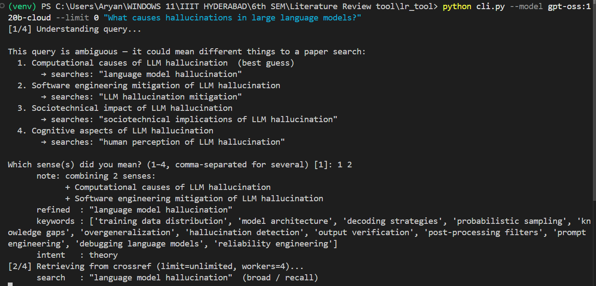
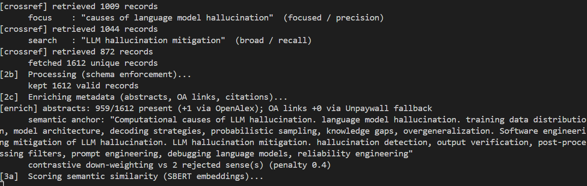
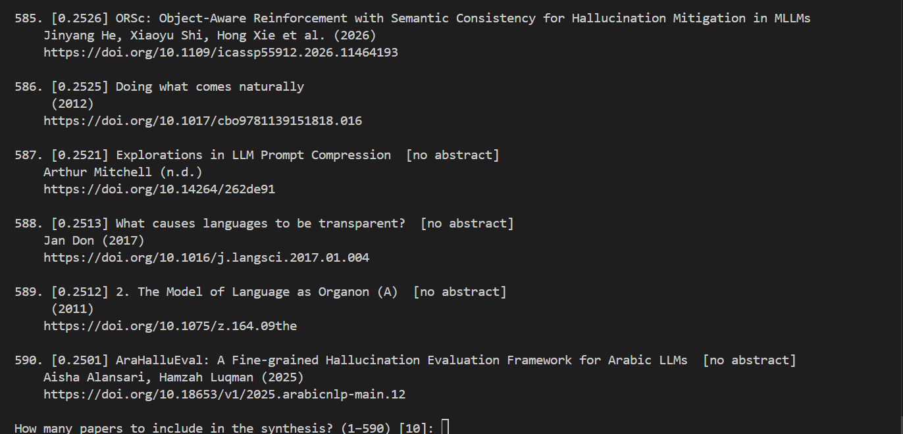
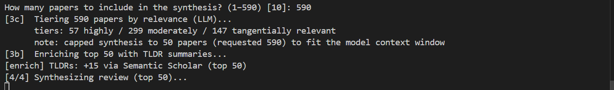
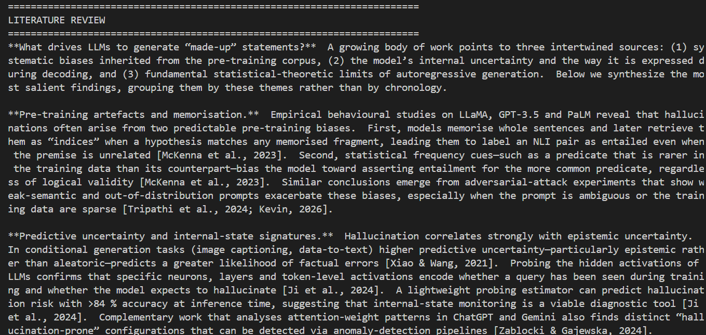
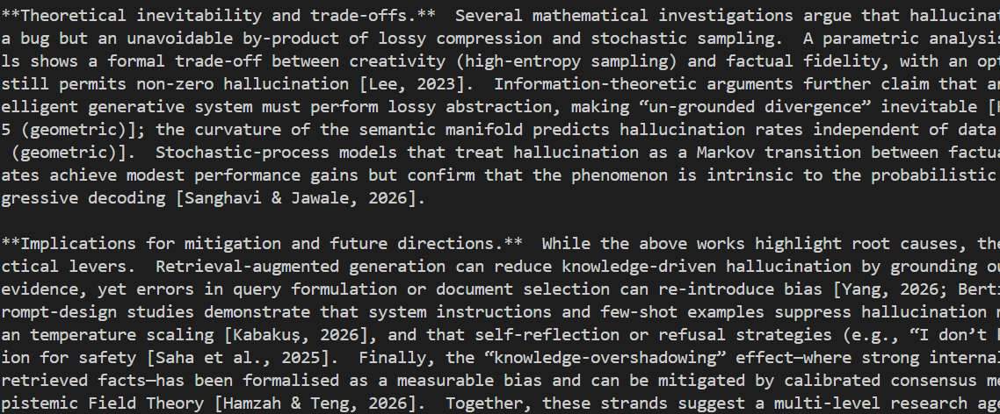

# Example outputs

These are **real, unedited runs** of `lr_tool` — the exact Markdown files the tool wrote to
disk, across four different research domains. Nothing here was hand-curated or cleaned up:
the rankings, DOIs, open-access links, relevance tiers, and the synthesized review are all
verbatim generator output. They double as evidence that the pipeline works end-to-end and as
a quick way to see what you get before installing anything.

Every example was produced against the live Crossref API (+ OpenAlex / Unpaywall / Semantic
Scholar enrichment), ranked with the SBERT hybrid scorer, and synthesized by `gpt-oss:120b`.

| Example | Query | Domain | Retrieved → ranked | Shows off |
|---|---|---|--:|---|
| [llm-hallucinations.md](llm-hallucinations.md) | *What causes hallucinations in large language models?* | AI / ML | 1612 → 590 | The full pipeline: multi-sense **disambiguation**, large-pool retrieval, all four **Relevance Tiers** (incl. 87 *irrelevant*), and a structured thematic review with inline `(Author, Year)` citations |
| [algorithm-comprehension.md](algorithm-comprehension.md) | *What constitutes the understanding of an algorithm…* | CS education | 2115 → top-K | Query refinement of a rambling natural-language question into `algorithm comprehension`; **Relevance Tiers** section |
| [human-development-life-course.md](human-development-life-course.md) | *What are the different phases in human development?* | Social science | 232 → top-K | Cross-domain generality (no CS terms); clean **Relevance Tiers** split (high / moderate / tangential / irrelevant) |
| [legal-compliance-checking.md](legal-compliance-checking.md) | *Conformance checking in legal documents* | Legal / compliance | 1021 → 393 | A niche, jargon-heavy topic; deep ranked list with OA links; survey-style synthesis |

## What a run looks like

A walkthrough of the [llm-hallucinations.md](llm-hallucinations.md) run, from the terminal:

**1. Disambiguation** — the tool spots that the query has several distinct senses and lets you pick one *or several* (here `1 2`):



**2. Retrieval + enrichment** — two-pass Crossref search (broad + focused), abstract/OA enrichment, the SBERT semantic anchor, and contrastive down-weighting of the rejected senses:



**3. Ranked list** — every candidate scored and ordered, then a prompt for how many to synthesize:



**4. Tiering + synthesis** — the LLM labels all 590 papers by relevance, then synthesis is capped to fit the context window and enriched with TLDRs:



**5. The review** — a structured, thematically-organized literature review with inline citations:




## How to read an example

Each file has three parts, in order:

1. **Header** — the refined query, extracted keywords, and classified intent that the LLM
   produced from the raw question.
2. **Papers table** — the score-ranked list (score, authors, year, abstract-present flag,
   DOI, open-access PDF link). This is ordered purely by the ranker.
3. **Relevance Tiers** *(newer runs)* — the same papers re-grouped by how relevant the model
   judged each to be to the *goal* (highly / moderately / tangentially / irrelevant). This is
   **purely additive** — nothing is removed from the table; it just labels the list and lets
   synthesis draw from the highly-relevant papers first.
4. **Literature Review** — the synthesized prose, citing the papers above.

## Reproduce one yourself

```bash
python cli.py "What causes hallucinations in large language models?"
```

Output is non-deterministic on cloud models, so your run won't match byte-for-byte — but the
shape, the sourcing, and the quality will.
